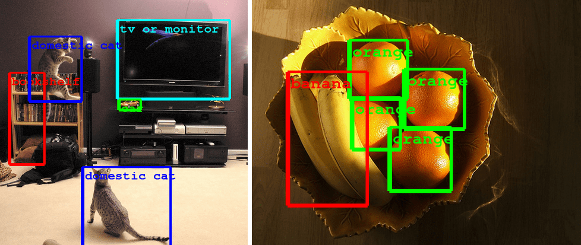
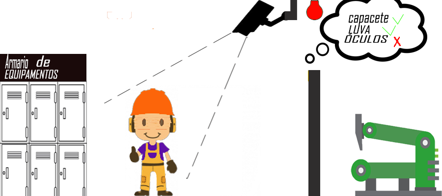

# WORK-SEC
Projeto desenvolvido para o evento Hackathon da Indústria 4.0

<a href="#conceptidea">Template Conceito da Ideia</a>  
<a href="#design">Design</a>  
<a href="#exemplo-ilustrativo">Exemplo ilustrativo</a>

________________________________________________________________________________________________________________________________________

## O que é a solução?
É um gerenciamento completo dos EPIs, no estoque, no uso, na validação (se o EPI é utilizável ainda, conforme as regras de qualidade do EPI), no expediente. Gerando uma maior segurança, aumento de produtividade e diminuição de gastos para a empresa, com contratação de fiscais ou de _gasto de energia_ (conforme característica abaixo).
   
## Como ela resolve o problema?
A ideia consistem nas seguintes características;
   - Através de sensor como o de código de barras ter a verificação de que o EPI foi retirado para uso. Assim como a devolução do mesmo;
   - Controlar o estoque e o ciclo de vida útil dos equipamentos, como data de validade, por meio da identificação de cada um;
   - Controlar o uso das máquinas pela validação do EPI através da visão computacional, de forma que sem a validação a corrente de energia não passe pela máquina;
   - Utiliza cameras para fiscalização do uso de EPI, por exemplo, em construção cívil um colaborador não está utilizando um capacete válido, logo que a camera o identificar mandará uma notificação ao encarregado da equipe com a determinada ocorrência;
   
## Quais os benefícios da solução?
A solução proporciona à empresa os seguintess benefícios.
   - Diminuição de gasto de energias;
   - Aumento de produtividade;
   - Informações para análise;
   
## Quais as características técnicas da solução e recursos  necessários?
Os recursos que são necessários para a solução são os seguintes:
   - Visão computacional;
   - Cameras dispostas na área de trabalho.

## Como será demonstrada a solução (protótipo)?
Por meio de uma demonstração do funcionamento. Validando o uso de um EPI e registrando o uso desse mesmo. 

## Componentes da equipe
- <a href="https://github.com/lpiere/">Luan Pieri Santos</a> (*Desenvolvedor hardware*)
- Gabriel Escalante Silva (*Desenvolvedor visão computacional*)
- Eduardo Fabian de Oliveira (*Designer*)
- Elisson Pereira (*Negócios*)
- Daniel Carlos Chaves Boll (*Programador*)

____________________________________________________________________________________________________________________________________

# Landing Page
A landing page para acompanhar mais de perto o projeto está disponível, [clique aqui.](https://worksec605659788.wordpress.com/)

# Design

## Data Base

Estamos utilizando a biblioteca SQL (SQLite3) no python, para fazer o armazenamento dos itens adquiridos pela camera e comparar com os itens pré-postos como a lista de EPI necessários do determinado local.

## Visão computacional
Estamos utilizando a visão computacional:

para fazer o reconhecimento dos EPIs, atualmente estamos treinando-a para reconhecer um _security helmet_.

### Aqui as imagens usadas para treinar

### Aqui um exemplo de nosso teste

### Exemplo ilustrativo

O funcionário está tendo seus EPIs identificados no vestuário, todavia falta o óculos para que ele possa entrar na área dos maquinários.
